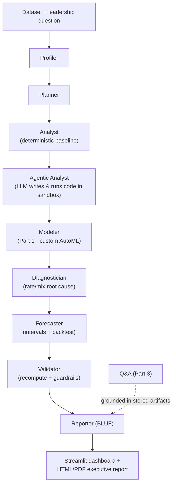

# 📊 Ledger — An Agentic AI Data Analyst for Leadership

Give Ledger a dataset. It profiles the data, models it, builds a leadership-ready
dashboard, and then **answers leadership's questions about its own work** — always
stating its confidence and limitations.

Unlike "chat with your CSV" demos, Ledger is built around **data-science rigor**:
the right metric (not raw accuracy), leakage-safe validation, projections with
backtested intervals, honest causal restraint, and an eval harness that proves it
recovers ground truth *and* knows what it doesn't know.

> Built as a portfolio project for fintech data-science roles. Demos run on a lending
> dataset (target = loan default) and the Kaggle credit-card fraud set (0.17% positive).

---

## Why this stands out (for reviewers)

Most "autonomous analyst" demos confidently hallucinate. Ledger is engineered to be a
*good* analyst — the data-science judgment is the point:

- **The right metric, not accuracy.** On the 0.17%-fraud dataset it auto-selects **PR-AUC**
  and explains why every model's 99.9% "accuracy" is meaningless.
- **Grounded by construction.** The agentic loop's numbers come from code it actually ran in
  a sandbox; Q&A answers only from stored artifacts. No vibes.
- **Knows what it doesn't know.** A validator does an independent recompute, calibrates
  confidence, and bans overclaiming language ("production-ready") in the briefing.
- **Honest forecasting.** Projections ship with 80% intervals *and* a walk-forward backtest
  that must beat a naive baseline.
- **Proven, not asserted.** An eval harness checks the agent recovers known ground truth
  (11/11).

## What it does — three parts

1. **Automated modeling (custom AutoML).** Detects the problem type, trains a panel
   of models (logistic/linear baseline → random forest → gradient boosting),
   ensembles them, and selects the winner by the *right* metric with proper
   cross-validation + a held-out test set, plus model-agnostic permutation-importance
   interpretation.
2. **Visualization.** Generates a presentable, interactive dashboard in
   Plotly/Streamlit and an exportable executive report (BLUF summary, KPI cards,
   charts with written takeaways).
3. **Conversational Q&A.** Ask in plain English about the dataset, *"which model won
   and why?"*, or *"what does chart 2 show?"* — answered strictly from the artifacts
   the agent produced, never guessed.

## Architecture



Built on **LangGraph** (typed `AnalysisState`) + **Claude** (`claude-opus-4-8`
reasoning, `claude-haiku-4-5` cheap steps). Full design in [SPEC.md](SPEC.md).

## Status — M1 ✅ · M2 ✅ · M3 ✅ · M3b ✅ · M4 ✅

- **M1** — skeleton, typed state, LangGraph wiring, sandbox, charts, grounded Q&A.
- **M2** — agentic analyst loop: the LLM writes pandas → runs it in the sandbox →
  self-corrects → emits grounded findings (`nodes/agentic_analyst.py`).
- **M3** — Part 1 AutoML modeler: custom model panel (logistic / random forest /
  gradient boosting + ensemble), leakage-safe pipelines, **selection by the right
  metric** (PR-AUC on imbalanced data, ROC-AUC on balanced) via CV + held-out test,
  permutation-importance interpretation → a `ModelLeaderboard` (`nodes/modeler.py`).
- **M3b** — rigor layer: **diagnostician** (rate/mix root-cause decomposition),
  **forecaster** (OLS trend + 80% prediction intervals + walk-forward backtest vs a
  naive baseline), and **validator** (independent recompute, aggregate confidence, and
  anti-overclaim guardrails the reporter must honor). 11/11 eval checks passing.

- **M4** — executive report export (`report/render.py`): one self-contained HTML file
  (BLUF, KPI cards, findings, model leaderboard, projections, inline charts, limitations).
  `run.py` writes it; the Streamlit app has a download button. PDF via the browser's
  Print → Save as PDF (renders the Plotly charts; weasyprint/kaleido can't).

Full active graph: `profiler → planner → analyst → agentic_analyst → modeler →
diagnostician → forecaster → validator → reporter`.

**Design note:** every LLM call is *optional*. The deterministic data-science core
runs with no API key; Claude adds the natural-language layer (narratives + Q&A).
This keeps the demo runnable out of the box and the DS core unit-testable.

## Quickstart

```bash
cd ledger
python -m venv .venv && source .venv/bin/activate
pip install -r requirements.txt

# (optional) enable narratives + LLM Q&A
echo "ANTHROPIC_API_KEY=sk-ant-..." > .env

# generate the flagship dataset
python -m data.generate_lending

# run the pipeline (CLI)
python run.py

# or the app
streamlit run app.py

# run the eval harness (11/11)
python -m evals.test_analyst

# run on the fraud dataset (download creditcard.csv from Kaggle into data/ first)
python run.py data/creditcard.csv "what is driving fraud?"
```

## Demo

See [`examples/`](examples/): a real generated [executive report](examples/sample_lending_report.html)
(open in a browser → Print → Save as PDF) and a [sample CLI transcript](examples/sample_cli_output.txt).

## Repo layout

```
ledger/
├── README.md · SPEC.md · LICENSE
├── app.py                  # Streamlit app (dashboard + live Q&A + report download)
├── run.py                  # CLI entry — runs the pipeline + writes the report
├── ledger/
│   ├── graph.py            # LangGraph wiring (9-node pipeline)
│   ├── state.py            # typed state + data contracts (Pydantic)
│   ├── llm.py · config.py  # optional Claude layer + settings
│   ├── nodes/              # profiler, planner, analyst, agentic_analyst, modeler,
│   │                       #   diagnostician, forecaster, validator, reporter, qa
│   ├── tools/              # sandbox (code exec), charts (executive theme)
│   └── report/             # self-contained HTML/PDF executive report
├── data/                   # dataset generator (CSVs are gitignored)
├── evals/                  # known-answer eval harness
└── examples/               # sample report + CLI transcript
```
